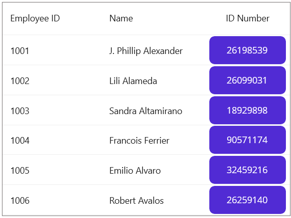

# How to get the RowIndex of a row in SfDataGrid when using DataGridTemplateColumn?

The [.NET MAUI DataGrid](https://www.syncfusion.com/maui-controls/maui-datagrid) provides various resolving methods to resolve the row index of grid rows based on certain criteria. The actual RowIndex of a row can be resolved by using the `ResolveToRowIndex(recordRowIndex)` method in SfDataGrid.

The RowIndex of a row can be obtained from DataGridTemplateColumn by retrieving the record index of the row using the bound data from its BindingContext and passing the recordRowIndex to the ResolveToRowIndex() method.

## XAML
```XML
<syncfusion:DataGridTemplateColumn HeaderText="ID Number" MappingName="IDNumber">
    <syncfusion:DataGridTemplateColumn.CellTemplate>
        <DataTemplate>
            <Button Text="{Binding IDNumber}" WidthRequest="120" HeightRequest="40" Clicked="Button_Clicked"/>
        </DataTemplate>
    </syncfusion:DataGridTemplateColumn.CellTemplate>
</syncfusion:DataGridTemplateColumn>

```
 

## C#

```C#
public partial class MainPage : ContentPage
{
    public MainPage()
    {
        InitializeComponent();
    }

    private void Button_Clicked(object sender, EventArgs e)
    {
        var button = sender as Button;
        var record = button.BindingContext as Employee;
        var recordRowIndex = viewModel.Employees.IndexOf(record);
        var rowIndex = datagrid.ResolveToRowIndex(recordRowIndex);
    }
}

```

> **Note** : RowIndex of the row can also be accessed by using [CellTapped](https://help.syncfusion.com/cr/maui/Syncfusion.Maui.DataGrid.SfDataGrid.html#Syncfusion_Maui_DataGrid_SfDataGrid_CellTapped), [CellDoubleTapped](https://help.syncfusion.com/cr/maui/Syncfusion.Maui.DataGrid.SfDataGrid.html#Syncfusion_Maui_DataGrid_SfDataGrid_CellDoubleTapped) and [CellLongPress](https://help.syncfusion.com/cr/maui/Syncfusion.Maui.DataGrid.SfDataGrid.html#Syncfusion_Maui_DataGrid_SfDataGrid_CellLongPress) events. When using complex layout inside a Template, ensure to set the InputTransparent property of the views loaded in the DataTemplate of the DataGridTemplateColumn as True.

The following screenshot shows how to get the RowIndex of a row when using DataGridTemplateColumn in SfDataGrid.



[View sample in GitHub](https://github.com/SyncfusionExamples/How-to-get-the-RowIndex-of-a-row-in-SfDataGrid-when-using-DataGridTemplateColumn/tree/master)

Take a moment to pursue this [documentation](https://help.syncfusion.com/maui/datagrid/overview), where you can find more about Syncfusion .NET MAUI DataGrid (SfDataGrid) with code examples.
Please refer to this [link](https://www.syncfusion.com/maui-controls/maui-datagrid) to learn about the essential features of Syncfusion .NET MAUI DataGrid(SfDataGrid).

### Conclusion
I hope you enjoyed learning about how to get the RowIndex of a row when using DataGridTemplateColumn in SfDataGrid.

You can refer to our [.NET MAUI DataGrid�s feature tour](https://www.syncfusion.com/maui-controls/maui-datagrid) page to know about its other groundbreaking feature representations. You can also explore our .NET MAUI DataGrid Documentation to understand how to present and manipulate data.
For current customers, you can check out our .NET MAUI components from the [License and Downloads](https://www.syncfusion.com/account/downloads) page. If you are new to Syncfusion, you can try our 30-day free trial to check out our .NET MAUI DataGrid and other .NET MAUI components.
If you have any queries or require clarifications, please let us know in comments below. You can also contact us through our [support forums](https://www.syncfusion.com/forums), [Direct-Trac](https://support.syncfusion.com/account/login?ReturnUrl=%2Faccount%2Fconnect%2Fauthorize%2Fcallback%3Fclient_id%3Dc54e52f3eb3cde0c3f20474f1bc179ed%26redirect_uri%3Dhttps%253A%252F%252Fsupport.syncfusion.com%252Fagent%252Flogincallback%26response_type%3Dcode%26scope%3Dopenid%2520profile%2520agent.api%2520integration.api%2520offline_access%2520kb.api%26state%3D8db41f98953a4d9ba40407b150ad4cf2%26code_challenge%3DvwHoT64z2h21eP_A9g7JWtr3vp3iPrvSjfh5hN5C7IE%26code_challenge_method%3DS256%26response_mode%3Dquery) or [feedback portal](https://www.syncfusion.com/feedback/maui?control=sfdatagrid). We are always happy to assist you!